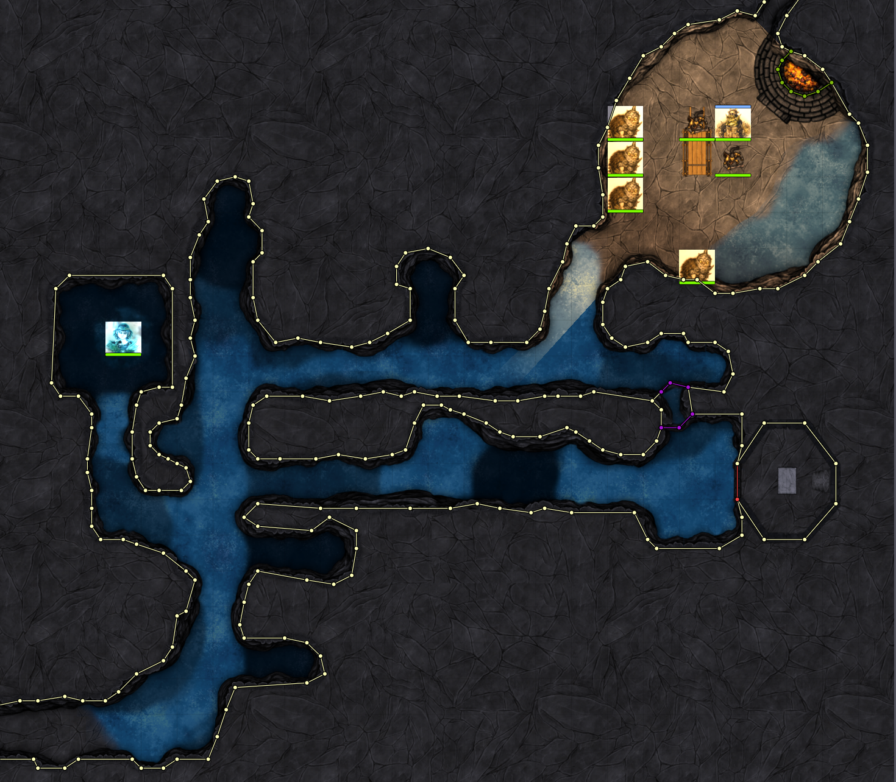

# Dragonbane Starter Campaign FoundryVTT Game World
**TL;DR:** Download the archive from the **release** page, then read the Installation instructions below very carefully

**Spoiler Alert:** This repo contains resources for the Dragonbane starter campaign intended for GM's. Consuming this repos might spoil the adventure as a player.

This repo contains:

* Tiled maps for the Dragonbane core game adventure. The maps utilizes Foundry's dynamic lighting and sound as well as background music and ambient sound in certain places (see screenshots below)
  * There are also some extra maps included which are not part of the original adventure (e.g. level 1-3 of the tower in 'the village of the day before' adventure)
* A bunch of tokens are provided to fill in the gaps where the original game doesn't provide tokens (for example common NPCs and some adventure tokens which are not provided).
* "Inspirational images" of the Omens and Travel events that can happen in the adventure
* Generic battlemaps for encounters in the wild (forests, towns, inn, plains, mountains are provided)
* A set of playlists which can provide atmosphere for the various locations

# Maps
**DISCLAIMER:** During the creation of the campaign maps, I changed techniques several times (due to my lack of experience in foundry and map making). This means that some maps feature heavy use of tiles inside foundry while others use a flat background image on which key tiles are placed. I.e. some maps won't be useful outside of FoundryVTT. See the description for each map (below) for more details.

### Opening Scene
The opening scene in the ravine with Wetherman and goblins waiting to ambush the players. This map is made completely inside foundry using tiles and is thus only usable in FoundryVTT.

### Riddermound
The Riddermound adventure, with Grub in hiding, the magical torches and several point of interests like the statues. This map doesn't use tiles to recreate the map. Instead, the official map from the book is used and FoundryVTT constructs are overlayed onto the map (such as walls, doors, lightning, etc.)

### Bothhild's Lode

* Outside Bothild's Lode (approaching the mine)
* Inside the first part of the mine (with goblins and wolfs)
* The Garrison
* Flooded mines

The maps use a static background image using forgotten adventures free tiles and FoundryVTT assets such as walls, lighting, sounds and tokens are added on top. The base maps should be usable outside of foundry. The mines are not exactly a 1:1 represenation of the campaign maps since the forgotten adventures cave tiles are a bit too incompatible in terms of size. But the basic structure of the mine is the same.

### Temple of the Purple Flame
Contains three maps, the temple and its basement as well as a representation of the demon realm. These maps again use the FoundryVTT tiling system so probably only usable inside FoundryVTT.

### Tower of Sighs
Contains 5 maps:
* The swamp surrounding the tower
* The ground level of the tower
* Level 2 and 3 of the tower
* The tower roof
* The underground temple

These scenes uses a base background image with FoundryVTT tiles and icons overlayed ontop of it. The background could be used outside of FoundryVTT.

### The Oracle Cave
A large map encompassing the outside, the cave and the keep. Tiles placed as overlays in FoundryVTT including cobwebs, stones, corpses etc. Includes NPC enemy spiders and the eel beast.

The background image should be usable in other systems.

### Troll's Spire
Three levels of the spire + roof and the crypt.

These maps use little to no tiles inside the FoundryVTT engine and should thus be completely usable outside of FoundryVTT.

### Dead Eyes Cave
Large map with the dead eyes cave system.

The map uses a background image + some tiles within FoundryVTT.

### Fort Malus
Large map with the Fort and room for players to approach the walls. Includes a basement map.

### The Village of the Day Before
Six maps
* Overview map of the entire time village
* A generic tavern map from Forgotten Adventures
* 4 levels of Kato's tower including the top floor with Kato and IX

### Road's end inn
Two maps
* The "normal" inn
* The nightmare version

### The Isle of Mists
Three maps
* The overworld Island
* The cave system
* The Labyrinth

### Generic Battlemaps
I've included 9 generic battlemaps from [Forgotten Adventures](https://www.forgotten-adventures.net/battlemaps/) for random encounters

### Omens
One "atmosphere" image for each of the demonic omens

### Random Encounters
Ten "atmosphere" images for what I consider important encounters, including the map of the misty vale (with correct grid scale so the FoundryVTT measuring tool can be used).

### Outskirts Atmosphere
Nine scenes to represent various locations in outskirt including the crypt of um-durman, battlemap for the inn and the town.

# Installation

Unfortunately you will have to do quite alot of manual installation. Sorry about that.

## Update the Required game system and modules

Make sure your FoundryVTT, dragonbane game system and modules are at least these versions. As always, it's always a good idea to backup eveything before you upgrade FoundryVTT.

* Foundry Version 11 Build 307
* Dragonbane Game System 1.2.0
* Dragonbane Core Set 1.0.0
* Year Zero Engine: Combat 1.1.0

## Install Highly recommended modules

Make sure you have the following modules are installed and up to date as well since these modules provide important game mechanics

* FXMaster - Additional weather and dungeon effects
* Torch - Abilitiy to create a light surrounding a character (some maps are very dark, as they should be)
* Michael Ghelfi Studios Audio Pack - Ambient sound effects and music

## Installing DoDCampaign-v2.0.7z

* Extract the DoDCampaign-v2.0.7z archive
* Copy the contents of the Data folder to FoundryVTT's Data folder

## Game World Setup

* In Foundry, Create a new world using the Dragonbane game system (or, use an existing dragonbane game system, make sure it's updated though)
* On startup Import Adventure
* Go to: Game Settings -> Manage Modules and enable the following modules:
  * Year Zero Engine: Combat
  * FXMaster
  * Torch
  * Michael Ghelfi Studios Audio Pack
  * Dragonbane Core Set (or the Swedish equivalent)
* Save Module Setting
* Popup: Dragonbane Rules: Import Adventure
* Popup: Dragonbane - Adventures: Import Adventure
  * Yes overwrite

## Adding Missing Token Portraits
For the following tokens (in Actors -> Dragonbane - Adventures), add the following paths to the token/prototype token portraits.

You do this by:
* Clicking the actor in the right-hand menu
* Click the portrait
* Paste the path under the __Selected__ input box
* Click __Select File__
* Click __Prototype Token__
* Click __Appearance__
* Paste the path in the __Image Path__ input box
* Click __Update Token__

### 4. Journeys
* Tylos: Tokens/heroes/FA_Tokens/Heroes/_Catch-All_Heroes/Paladin_Sword_Shield_01.png

### 6. Bothilds Lode
* The White Death: Tokens/Creatures/CR_1%E2%81%842/Giant_Sea_Horse_Large_Beast_01.png
* Worg: images/campaign/npc/enemy/ulv.png

### 9. Oracle Cave
Spiderlings: Tokens/Creatures/CR_0/Spider_Many_Tiny_Beast_01.png
The eel Beast: Tokens/Creatures/CR_1%E2%81%842/Giant_Sea_Horse_Large_Beast_01.png

### 11. Dead Eye Cave
The Basilisk: Tokens/Creatures/CR_1%E2%81%848/Flying_Snake_Tiny_Beast_01.png
Viper: Tokens/Creatures/CR_1%E2%81%848/Poisonous_Snake_Tiny_Beast_01.png

### Actors -> Dragonbane Rules -> Typical NPCs

You can select your own or copy mine:

Adventurer: Tokens/heroes/FA_Tokens/Heroes/_Catch-All_Heroes/Barbarian_Greataxe_01.png
Archmage (Boss): Tokens/heroes/FA_Tokens/Heroes/_Catch-All_Heroes/Wizard_Staff_Magic_Spellbook_01.png
Bandit: Tokens/advesaries/FA_Tokens/Adversaries/Bandits/Bandit_Brute_Shovel_01.png
Bandit Chief (Boss): Tokens/advesaries/FA_Tokens/Adversaries/Bandits/Bandit_Captain_Sword_Dagger_B_01.png
Cultist: Tokens/heroes/FA_Tokens/Heroes/_Catch-All_Heroes/Warlock_Sword_01.png
Guard: Tokens/advesaries/Tokens/Adversaries/Desert_Guards/Desert_Guard_Sword_Shield_01.png
Hunter: Tokens/heroes/FA_Tokens/Heroes/_Catch-All_Heroes/Ranger_Bow_01.png
Knight Champion (Boss): Tokens/heroes/FA_Tokens/Heroes/_Catch-All_Heroes/Cleric_Mace_Shield_01.png
Thief: Tokens/heroes/FA_Tokens/Heroes/_Catch-All_Heroes/Rogue_Daggers_01.png
Scholar: Tokens/npc/Tokens/NPCs/Townsfolk/Human/Human_Male_Crier_04.png

### Random villagers
* Only edit the prototype token for villagers and set the __Image Path__ to: Tokens/npc/FA_Tokens/NPCs/Townsfolk_02/*.png
* Make sure to enable __Randomize Wildcard Images__ in the prototype token
* Click __Update Token__

This will place random villagers when placing villager tokens on a map.

## Importing Playlists:
* Create an empty Playlist with a temporary name and close the playlist dialogue
* Right click the new playlist and select import data
* Navigate to your downloaded DoDCampaign folder, select: common -> playlists and select the first playlist

Repeat this procedure for all playlist lists in the common -> playlists folder

## The Riddermound Journal

I created a journal with images for the Riddermound adventure that can be shown to players if desired.

* Go to Journal -> Create Journal Entry -> Select a temporary name and click __Create new Journal Entry__.
* Right click the jounral and select __Import Data__
* navigate to DoDCampaign -> common -> journal and select fvtt-JournalEntry-05-riddermound-0zEHMf0ZOZxPlSAh.json
* Click Import

## Scenes

Create folders for travel, omen, battlemaps and adventure scenes by clicking: Scenes -> Create Folder.

### Travel

In the travel scene folder, create 9 empty scenes. Right click each scene, select Import Data and import the json files in DoDCampaign -> common -> scenes -> travel

### Omen

In the omen scene folder, create 10 empty scenes. Right click each scene, select Import Data and import the json files in DoDCampaign -> common -> scenes -> omen

### Battlemaps

In the battlemaps scene folder, create 8 empty scenes. Right click each scene, select Import Data and import the json files in DoDCampaign -> common -> scenes -> battlemaps

### Adventures

I recommend creating a sub folder for each chapter in the adventure book (e.g. 02 - Opening Scene, etc.). Under each subfolder, create empty scenes and import the json scenes for each of the scene for the adventures.

### Restart the Game World

**IMPORTANT: After all scenes are imported; it's important to logout of the game world and reload it. For some reason, some tiles are missplaced when imported and will only be loaded correctly on world reload.**

## Set playlists in scenes

The last step is to set the playlists to play on scene activation. You can experiment with the playlists and/or choose your own; I found that we following works for me:

TO set a scene playlist; Right click on a scene ans choose configure. Click the __Ambience__ and select the Scene Playlist (and optionally Playlist sound)

### 2 Start Scene
- Drakmar pass - Desert Wind

### 4 Outskirts
- BM inn - Music - TheInn
- BM Town - Ambient - VillageMarketplace
- Crypt Um-durman - Ambient - Cavern of Horror
- Outskirt - Inn - Music - TheInn
- Outskirt - Mill - Ambient - Craftmensguild
- Outskirt - Dranath - Music - Crimsoncrowbrimstoneircle
- Outskirt - Smith - smith playlist
- Outskirt - temple - ambient - simplecave
- Outskirt - tradeshop - shops playlist 

### 5 Riddermound
- Kummeln - eerie wind playlist
- Riddermound - Ambient - Hallofnightmares

### 7 Purple Temple
- Demoncity - Inside human playlist
- Over - ambient - precursor hall

### 8 Tower of Sighs
- Outside/level 2,3,roof = swamp

### 10 Trollspire
- Crypt - Ambient - Haunted House Cellar
- Roof - Abient - Snowing

### 11 Dead Eye
- Cave - Ambient - Cavern of trials

### 12 Fort Mallus
- Fort - Ambient - DarketsForest
- Fort - Ambient - Darketforest

### 13 Yesterdays village
- Village - Music - Beyond the frost barrier
- tower 4 - music - The eldrich creature

### 14 Road's end inn
- Inn - music - taverns of glaenarm
- Haunted INn - Ambient - Hall of nightmares

### 15 Isle of mists
- Isle - ambient - worlds end
- cave - ambient - dungeon of the dead three
- labyrinth - ambient - generic dungeon

### Travel Scenes
- egg - eerie wind
- archer - ambient - daytime forest
- griffon - crimsonarchers
- hanged cultists - eerie wind
- obelisk - ambient- dimensiongate
- old woman herbalist - ambient - daytime forest
- sefyra thunder
- outskirts gate - music - beyond the frost barrier
- wounded adventurers - fireplace

### Battlemaps
- city entrance - forest
- dark mountains - thunder
- desert mountains - desert winds
- forest outskirt - forest
- forest road - forest
- mountains - thunder
- swamp bridge - swamp
- thicker forest - forest

### Omen
- black rider - eerie wind
- cluds - eerie wind
- eclipse - eerie wind
- falling stars - Music - Beyond the frost barrier
- ambient - worlds end
- frogs - swamp
- locust swamp
- quake - eerie wind
- raining blood - rain
- volcano - thunder

# Acknowledgement
Tiles and NPC tokens from [Forgotten Adventures](https://www.forgotten-adventures.net/)

Animations from [Jack Kerouac's Animated Spell Effects](https://gitlab.com/jackkerouac/animated-spell-effects)

Sound effects from the [BBC Sound Archive](https://sound-effects.bbcrewind.co.uk/)

Battlemaps from [Forgotten Adventures](https://www.forgotten-adventures.net/battlemaps/)
